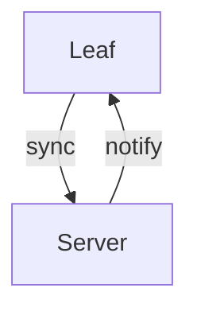

# Mermaid Diagrams

The mermaid plugin renders diagram definitions as SVG graphics using
[mermaid.js](https://mermaid.js.org/), a JavaScript-based diagramming
and charting tool.

## Usage

Use fenced code blocks with the `mermaid` language tag:

````markdown

````

## Supported diagram types

Mermaid supports a wide range of diagram types including:

- **Flowchart** (`graph TD`, `flowchart TB`, etc.)
- **Sequence diagram** (`sequenceDiagram`)
- **Class diagram** (`classDiagram`)
- **State diagram** (`stateDiagram-v2`)
- **Entity Relationship diagram** (`erDiagram`)
- **Gantt chart** (`gantt`)
- **Pie chart** (`pie`)
- **Git graph** (`gitGraph`)
- **Mindmap** (`mindmap`)
- **Timeline** (`timeline`)

See the [Mermaid documentation](https://mermaid.js.org/intro/) for a
complete reference.

## Configuration

No configuration options are required.  Add `"mermaid"` to the
`markdown.plugins` list in your spa-config:

```json
{
  "markdown": {
    "plugins": ["mermaid"]
  }
}
```
